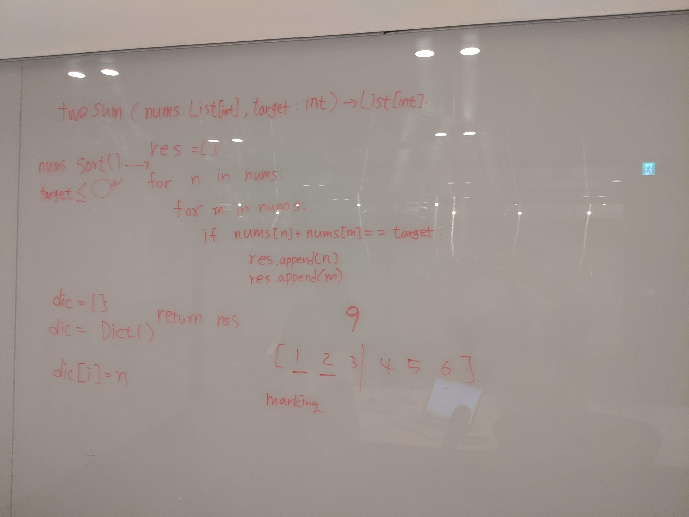
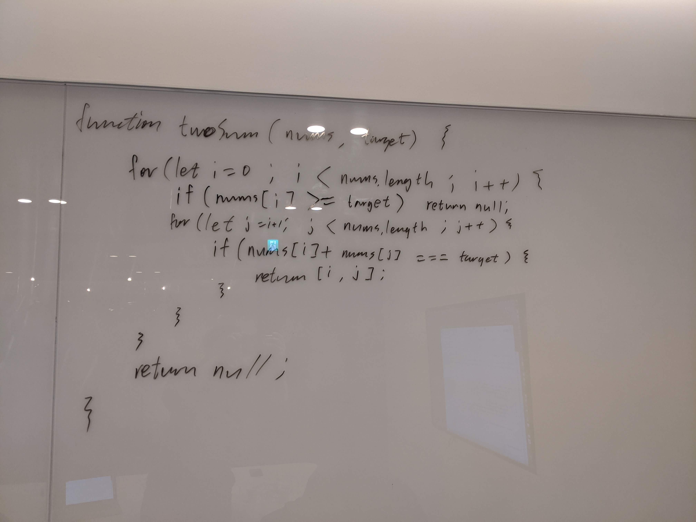
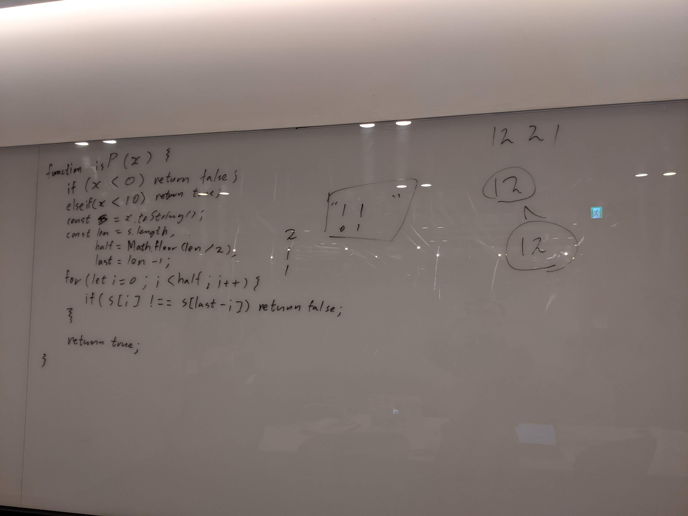

# 1회차 스터디
`2020. 01. 18`
진행자 김지훈

## Round 1
### Problem - [Two Sum](https://leetcode.com/problems/two-sum/)
```
Given an array of integers, return indices of the two numbers such that they add up to a specific target.

You may assume that each input would have exactly one solution, and you may not use the same element twice.

---
Example:

Given nums = [2, 7, 11, 15], target = 9,

Because nums[0] + nums[1] = 2 + 7 = 9,
return [0, 1].
```

#### 고은정


```python
 def twoSum(self, nums: List[int], target: int) -> List[int]:
    for i in range(len(nums)):
        for j in range(len(nums)):
            if nums[i] + nums[j] == target:
                return [i,j]
```
- 다시 풀어보니 이전 풀이가 틀렸다는 걸 깨달았다. 단순히 값으로 루프를 돌았던 것 같은데 인덱스를 리턴해야 한다.
- 파이썬이 알고리즘 풀기엔 가장 편하지만 사용 언어로 트집 잡힐 염려 때문에 그냥 무난한 js로 바꿀까 싶기도 하다.

#### 서경원


##### Code
```javascript
/**
 * @param {number[]} nums
 * @param {number} target
 * @return {number[]}
 */
var twoSum = function(nums, target) {
    const len = nums.length;
    for (let i = 0 ; i < len ; i++) {
        for (let j = i + 1 ; j < len ; j++) {
            if (nums[i] + nums[j] === target) {
                return [i, j];
            }
        }
    }
    return [];
};
```


## Round 2
### Problem - [Palindrom Number](https://leetcode.com/problems/palindrome-number/)
```
Determine whether an integer is a palindrome. An integer is a palindrome when it reads the same backward as forward.

---
Example 1:

Input: 121
Output: true
---
Example 2:

Input: -121
Output: false
Explanation: From left to right, it reads -121. From right to left, it becomes 121-. Therefore it is not a palindrome.
---
Example 3:

Input: 10
Output: false
Explanation: Reads 01 from right to left. Therefore it is not a palindrome.
---
Follow up
:: Coud you solve it without converting the integer to a string?
```

#### 고은정

```python
def isPalindrome(self, x: int) -> bool:
    x = str(x)
    size = len(x)
    half = len(x)//2

    if size%2 == 0:
        last = x[half:size]
    else:
        last = x[half+1:size]

    if x[0:half] == last[::-1]:
        return True
    return False
```
```javascript
/**
 * @param {number} x
 * @return {boolean}
 */
var isPalindrome = function(x) {
    if(x < 0){ // -121
        return false;
    }

    if(x < 10){ // '0..9'
        return true;
    }

    var p = x.toString()
    var len = p.length;

    // '121' [012] 3/2=1.5
    // '1221' [0123] 4/2=2
    for(let i=0; i<len/2; i++){
        if(p[i] !== p[len-i-1]){
            return false
            //p[0] == p[3-0-1 = 2]
            //p[1] == p[3-1-1 = 1]
        }
    }
    return true;
};
```
- python은 예전에 리트코드에 서브밋 했던 코드...
- 인덱스 조건을 잘 쓰면 한줄로도 할 수 있는데, 잡기술이나 숏코딩은 어차피 까먹음
- js로 다시 풀어보았다
- 서브밋 하기 전에 손 디버깅 해보는게 중요한 것 같다. 간단한 문제긴 하지만 오타 없이 한번에 통과해서 기분좋음
- 구글은 구글독스에 에디터 지원 없이 풀어야 하기 때문에 테스트 케이스를 미리 체크하는 연습을 하자

#### 서경원


##### Code

```javascript
/**
 * @param {number} x
 * @return {boolean}
 */
var isPalindrome = function(x) {
    if (x < 0) {
        return false;
    } else if (x < 10) {
        return true;
    }

    const str = x.toString();
    const len = str.length;
    const last = len - 1;
    const half = Math.floor(len / 2);
    for (let i = 0 ; i < half ; i++) {
        if (str[i] !== str[last - i]) {
            return false;
        }
    }
    return true;
};
```

##### Retrospective
- 오랜만에 시작하니 감을 많이 잃은 것 같다.
- 다시 처음부터 한다는 마음가짐으로 진행해야할 것 같다.
- 한 문제를 풀 때 다양한 시각으로 보는 연습이 필요하다.

#### 김지훈
* 역시 자주해야... 간만에 하니까 머리가 안 돌아감

## Retrospective
* 오랫만에 하려니까 정말 쉽지 않다.
* 같은 문제를 다른 언어로 풀어보는게 어느정도 도움이 되는 것 같다.
* 작년에 한거 다 까먹은 것 같다.
